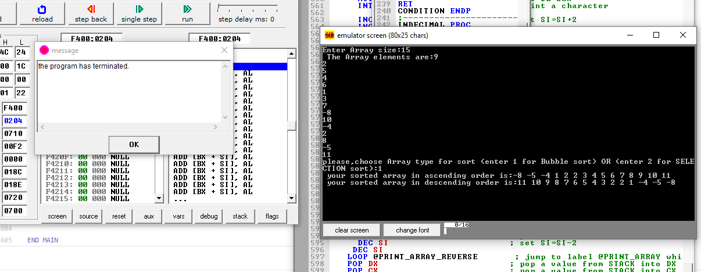
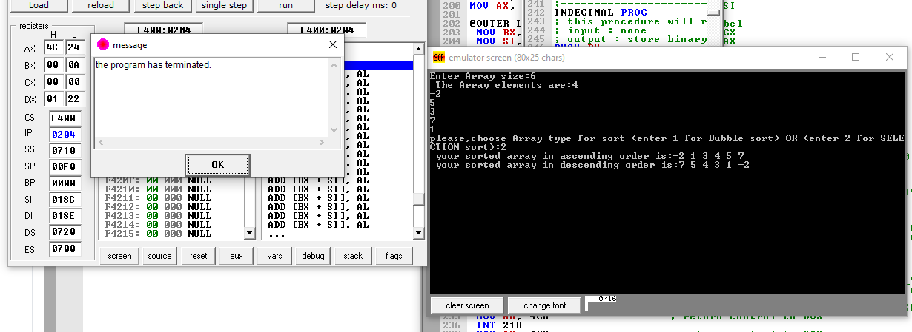
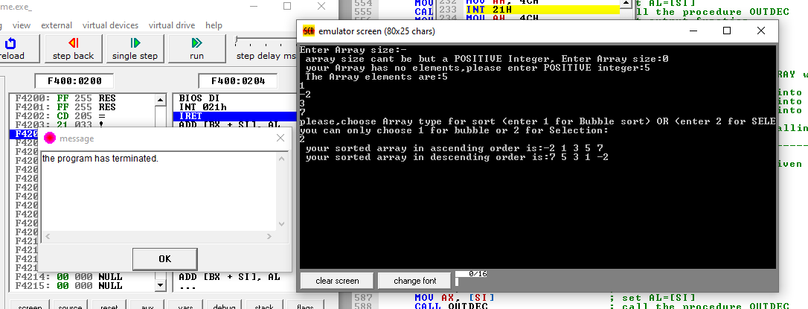

**Our Names Are:**

  1. Abdelrahman Mostafa.
  2. Amir Nabil.
  3. Aya Ashraf.
  4. El-sayed Atef.
  5. Shereen Gamal.

**Introduction:**

  Sorting algorithms are ways to reorganize a large number of items in a specific order like high to low, vice versa, or even in some alphabetical order.
  These algorithms take an input list, process it (i.e. perform some operations on it) and produce the sorted list.
  Types of Sorting Algorithms:
      
      1-Bubble Sort
      2-Selection Sort
      3-Merge Sort
      4-Insertion Sort
      5-Quick Sort
      6-Heap Sort
      7-Radix Sort
      8-Bucket Sort
  The complexity of sorting algorithm calculates the running time of a function in which 'N' number of items are to be sorted. The choice for which sorting method is suitable
  for a problem depends on several dependency configurations for different problems. The most noteworthy of these considerations are:
  
      1-The length of time spent by the programmer in programming a specific sorting program
      2-Amount of machine time necessary for running the program
      3-The amount of memory necessary for running the program
      
   so, to get the amount of time required to sort an array of 'N' elements by a particular method, the normal approach is to analyze the method to find the number of comparisons
   (or exchanges) required by it. Most of the sorting techniques are data sensitive, and so the metrics for them depends on the order in which they appear in an input array.
      
   Various sorting techniques are analyzed in various cases and named these cases as follows:

      Best case
      Worst case
      Average case
  Hence, the result of these cases is often a formula giving the average time required for a particular sort of size 'N.' Most of the sort methods have time requirements that
  range from O(Nlog N) to O(N2).
 
 
**Project:**

  Our project is array sorting using two techniques (Bubble sort , Quick sort).
    with UI which PROMPT the user  
    
      1- first to enter the size of array.
      
      2- next ask to enter the array element by element.
      
      3- then ask to make choice between two techniques.
      
    
**Content of data segment:**

    1. Array with length of 100.
    2. Two variables one for array size and the other for making choice.
    
**Steps of  coding :**

    1. Taking the first input 'ARRAY_size' from the user.
    2. Making a function to convert the input from ASKI to its decimal value, that is called 'INDECIMAL', we will call this function for every input we would take from user.
    3. Taking the second input 'ARRAY' element by element from the user using 'READ_ARRAY' function in our code.
    4. Condition code.
    6. Bubble sort code.
    7. Selection sort code.
  
**Bubble Sort Algorithm**

  -It is a simple algorithm which is used to sort a given set of n elements provided in form of an array with n number of elements. Bubble Sort compares all the element one by   one and sort them based on their values.
  
  -If the given array has to be sorted in ascending order, then bubble sort will start by comparing the first element of the array with the second element, if the first element
   is greater than the second element, it will swap both the elements, and then move on to compare the second and the third element, and so on.
   
   -If we have total n elements, then we need to repeat this process for n-1 times.
   
   -It is known as bubble sort, because with every complete iteration the largest element in the given array, bubbles up towards the last place or the highest index, just like a water bubble rises up to the water surface.
   
  -Sorting takes place by stepping through all the elements one-by-one and comparing it with the adjacent element and swapping them if required.
  
  -An example shown in figure below
  
  

**Selection Sort Algorithm**

The selection sort algorithm sorts an array by repeatedly finding the minimum element (considering ascending order) from unsorted part and putting it at the beginning. The algorithm maintains two subarrays in a given array.

    1- The subarray which is already sorted.
    2- Remaining subarray which is unsorted.

In every iteration of selection sort, the minimum element (considering ascending order) from the unsorted subarray is picked and moved to the sorted subarray.
 
  -An example shown in figure below
 

**OUTPUTS**

     1- Output of bubble sort example with array length of 15
  
  
  
  
     2-Output of selection sort example with array length of 6

     3-Output of selection sort but with length negative then zero and wrong input to choose sorting type
     
    
  

  
  
  
**C++ code :**

     
    #include <iostream>

    using namespace std;

    //Swap function
    void swap(int *xp, int *yp) 
    { 
    int temp = *xp; 
    *xp = *yp; 
    *yp = temp; 
    }

    // BUBBLE_SORT Function code 
   
    void BUBBLE_SORT(int arr[], int n)  
    {  
      for (int i = 0; i < n-1; i++)      
         for (int j = 0; j < n-i-1; j++)                                 // "j < n-i-1" Because Last i elements are already in place  
            if (arr[j] > arr[j+1])  
               swap(&arr[j], &arr[j+1]);  
    }  
 
    // SELECTION_SORT Function code 

    void Selection_Sort(int arr[], int n)  
    {  
         int i, j, min_idx;  
  
         // One by one move boundary of unsorted subarray  
         for (i = 0; i < n-1; i++)  
        {  
     // Find the minimum element in unsorted array  
           min_idx = i;  
                 for (j = i+1; j < n; j++)  
                    if (arr[j] < arr[min_idx])  
                       min_idx = j;  
           // Swap the found minimum element with the first element  
          swap(&arr[min_idx], &arr[i]);  
       }  
    }   

    void Print_Ascending_Array(int arr[], int size)  
    {  
    cout <<"your sorted array in ascending order is:  ";

    for (int i=0; i < size; i++)  
        cout << arr[i] << "   ";  
    cout << endl;  
    }  

    void Print_Descending_Array(int arr[], int size)  
    {  
    cout <<"your sorted array in descending order is:  ";

    for (int i=size-1; i >=0; i--)  
        cout << arr[i] << "   ";  
     cout << endl;  
    }  

    int main() 
    {
    int length,choice;
    cout<<"Enter Array size : ";
    cin >>length;
    while (length<=0){
    cout <<"array size can't be negative or zero, please enter a POSITIVE number ";
    cin >>length;
                     }
    int array[length];
    cout <<"The Array elements are : ";
    for(int i=0;i<length;i++)
    {
    cin >> array[i];
    }
    cout <<"please,choose Array type for sort (enter 1 for Bubble sort) OR (enter 2 for SELECTION sort :  ";
    cin >> choice;

    while ((choice>2) || (choice<1)){
      cout <<"you can only choose 1 for bubble or 2 for Selection ";
    cin >>choice;
                                    }
    if(choice == 1){
    BUBBLE_SORT(array,length);
    Print_Ascending_Array(array, length);
    Print_Descending_Array(array, length);
                   }
    else if (choice == 2){ 
    Selection_Sort(array,length);
    Print_Ascending_Array(array, length);
    Print_Descending_Array(array, length);
                         }
    return 0;
    }

